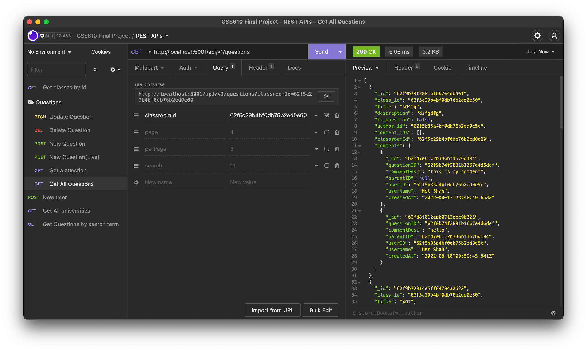
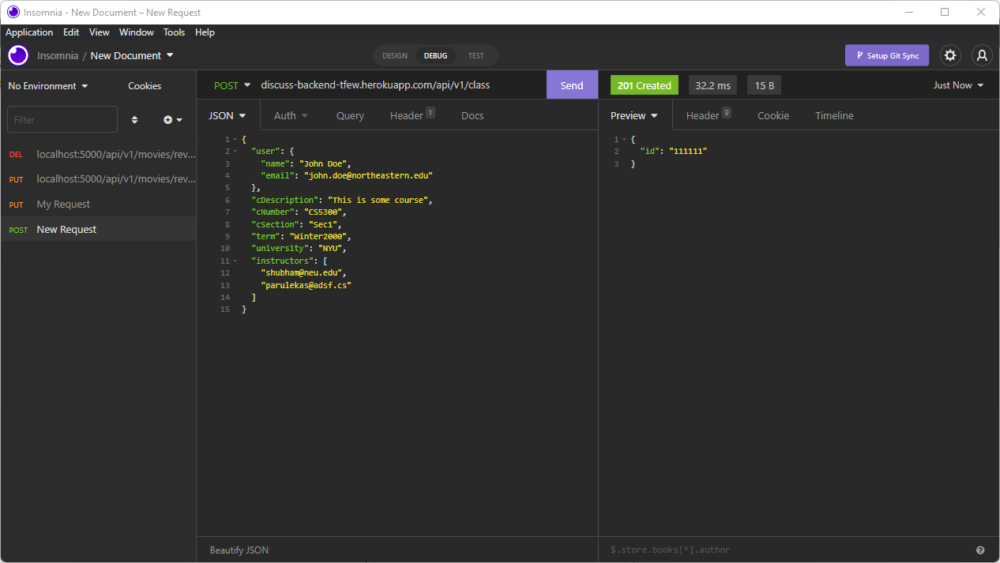
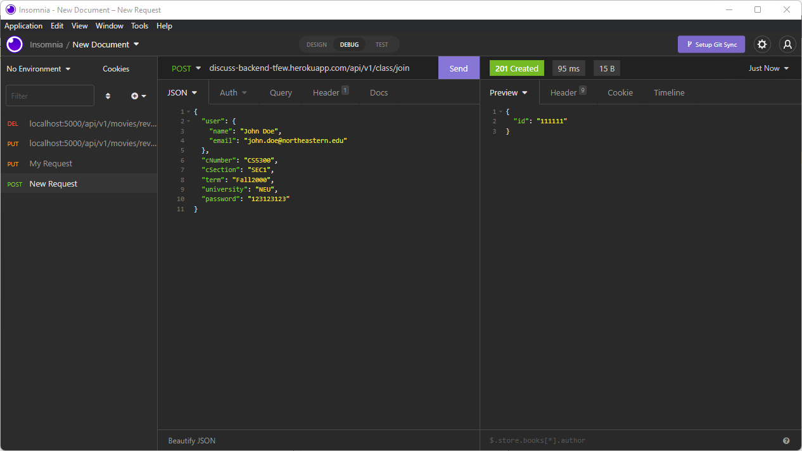
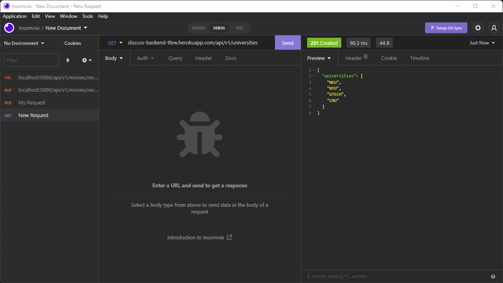

# Classroom Discussion Forum (Backend)

_Classroom Discussion Forum_ is a platform for instructors and students to collectively solve doubts of other students.

**Heroku URL:** [https://discuss-backend-tfew.herokuapp.com/api/v1/](https://discuss-backend-tfew.herokuapp.com/api/v1/)

## Contributors

- Anwesa Basu(basu.anw@northeastern.edu)
- Het Chetan Shah (shah.het2@northeastern.edu)
- Shubham Atul Parulekar (parulekar.s@northeastern.edu)
- Swapnendu Majumdar (majumdar.s@northeastern.edu)

## Iteration 3

#### Notes:-

1. As a part of this iteration, we have mainly implemented comment and question edit capabilities.

### Contribution

- **Anwesa Basu**

  - [Fetch all comments](#fetch-all-comments)
  - [Delete existing Comment](#delete-existing-comment)

- **Het Shah**

  - [Updated get all questions api](#updated-get-all-questions)
  - Integrated all the branches into main and resolved merge conflicts

- **Shubham Parulekar**

  - Naming Fixes

- **Swapnendu Majumdar:**
  - [Post new comment](#post-new-comment)
  - [Update existing comment](#update-existing-comment)

### Fetch all comments

#### Activities:-

1. Fetching all the comments of a post based on questionId.
2. Creation of collection comments in database.
3. Connection with backendAPI with mongoDB to get the data back.

**URL** : `api/v1/comments/questionId`

**METHOD** : `GET`


### Delete existing comment

#### Activities:-

1. Delete a specific comment of a post based on questionId and userId.

**URL** : `api/v1/comments/`

**METHOD** : `DELETE`


### Updated Get All Questions

#### Activities:-

1. Now returns comments along with the question

**URL** : `api/v1/questions`

**METHOD** : `GET`



### Post New Comment

#### Activities

1. Creation of post comment API for posting a new comment.
2. Sending the response back to frontend by establishing backend connection.

**Method** : `POST`

**URL** : http://localhost:5000/api/v1/comments/


### Update Existing Comment

#### Activities

1. Update an existing comment based on commentId

**Method** : `PUT`

**URL** : http://localhost:5000/api/v1/comments/


## Iteration 2

#### Notes:-

1. We have implemented some more APIs and we have added few of them as part of this interations.
2. We have created our individual git branches for individual functionalities and have integrated and merged them all in the main branch.
   (The individual branches for iteration 2 looks like :- f-name-itr2)

### Contribution

- **Anwesa Basu**

  - [Add new user_data](#add-a-new-user)
  - [User login](#login-existing-user)
  - [Fetch comments](#fetch-comments)

- **Het Shah**
  - [Get all Questions](#get-all-questions)
  - [New_question](#post-new-question)
  - Integrated all the branches into main and resolved merge conflicts
- **Shubham Parulekar**
  - [all-class-curd-operations](#class-curd-all)
- **Swapnendu Majumdar:**
  - [post_comment](#post-comment)

### Add a new user

#### Activities:-

1. Creating new DB collection named Users.
2. Building connection with MongoDB with backend API for CURD operation Create.
3. Successfully sending back the response to front end.
4. Validating an existing user.

**URL** : `api/v1/signup`

**METHOD** : `POST`


Validating Existing User:-


### Login existing user

#### Activities:-

1. Validating an existing user for user login(If user is not existing login will fail)
2. Connection with MongoDB for validation of the login data back to the frontend.

**URL** : `api/v1/signin`

**METHOD** : `POST`


### Fetch comments

(Not deployed in heroku,commited to individual github branch)

#### Activities:-

1. Fetching all the comments of a post based on questionid.
2. Creation of collection comments in database.
3. Connection with backendAPI with mongoDB to get the data back.

**URL** : `api/v1/comments/questionId`

**METHOD** : `GET`


### Get All Questions

#### Activities:-

1. Creation of collection question in DB
2. Fetching all the questions from question collection
3. Establsihing connection with mongoDB with backend API

**URL** : `api/v1/questions`

**METHOD** : `GET`


### Post new question

#### Activities

1. Creation of collection question in DB.
2. Posting a new question entered by the user and sending the response back to the frontend.

**URL** : `api/v1/questions/newPost`

**METHOD** : `POST`


### class-curd-all

#### Activities

1. Creation ofall class CURD operations including create,delete,update,get etc.
2. Handling user DB operations related to class

**Method** : `GET`

**URL** : localhost:5000/api/v1/class/62f1d49732d7f835d3c07a96


**Method** : `DELETE`

**URL** : localhost:5000/api/v1/class


**Method** : `JOIN`

**URL** : localhost:5000/api/v1/class/join


**Method** : `UPDATE`

**URL** :localhost:5000/api/v1/class/


### post-comment

#### Activities

1. Creation of post comment API for posting a new comment.
2. Sending the response back to frontend by establishing backend connection.

**Method** : `POST`

**URL** : http://localhost:5000/api/v1/comments/


## Iteration 1

### Contribution

- **Anwesa Basu**
  - [Register a user](#registering-a-new-user)
  - [View an existing Post](#view-an-existing-post)
- **Het Shah**
  - [List of Questions](#list-of-questions)
  - Integrated all the branches into main and resolved merge conflicts
- **Shubham Parulekar**
  - [Create class](#create-class)
  - [Join class](#join-class)
  - [Get universities](#get-universities)
- **Swapnendu Majumdar:**
  - Log an existing user into the system. [Jump](#page-login)
  - Create a new post. [Jump](#page-create-a-post)

### Registering a new user

Saves the information of a new user.

**URL** : `api/v1/signup`

**METHOD** : `GET`

**Accepted Params** :

```json
{
  "emailId": "String. Required.",
  "username": "String. Required.",
  "password": "String. Required."
}
```


### View an existing post

Shows a selected post details.

**URL** : `api/v1/questions/id/:id`

**METHOD** : `GET`

**Accepted Params** :
Enter the :id to send an id. Get does not require a JSON body.


### List of Questions

Returns all the questions that have been asked for the given classroom.

**URL** : `/api/v1/questions`

**METHOD** : `GET`

**Accepted Params** :

```json
{
  "classromId": "Integer. Required.",
  "search": "String. Optional.",
  "page": "Integer. Optional.",
  "perPage": "Integer. Optional."
}
```


### Create class

Creates a class and return its id.

**URL** : `/api/v1/class`

**METHOD** : `POST`

**Accepted Params** :

```json
{
  "user": "User Object. Required.",
  "cDescription": "String. Required",
  "cNumber": "String. Required",
  "cSection": "String. Required",
  "term": "String. Required",
  "university": "String. Required",
  "instructors": "List of String. Optional"
}
```



### Join class

Makes a user to join a class and returns the class's id.

**URL** : `/api/v1/class/join`

**METHOD** : `Post`

**Accepted Params** :

```json
{
  "user": "User Object. Required.",
  "cNumber": "String. Required",
  "cSection": "String. Required",
  "term": "String. Required",
  "university": "String. Required",
  "password": "String. Required"
}
```



### Get universities

Returns all the questions that have been asked for the given classroom.

**URL** : `/api/v1/universities`

**METHOD** : `GET`



### _Page:_ Login

Sends the login credentials entered by the user, and fetches their information on succesful sign-in.

**URL** : `api/v1/signin`

**METHOD** : `POST`

**Accepted Params** :

```json
{
  "email": "String. Required.",
  "password": "String. Required."
}
```


### _Page:_ Create a post

Creates a new post and returns its id.

**URL** : `/api/v1/questions/newPost`

**METHOD** : `POST`

**Accepted Params** :

```json
{
  "_id": "Integer. Required.",
  "title": "String. Required",
  "description": "String. Required"
}
```


